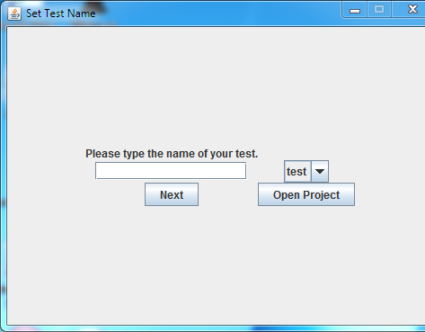
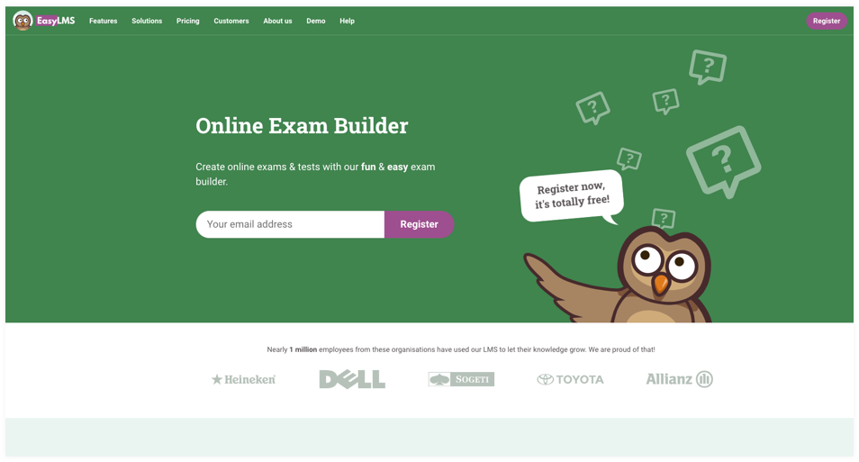
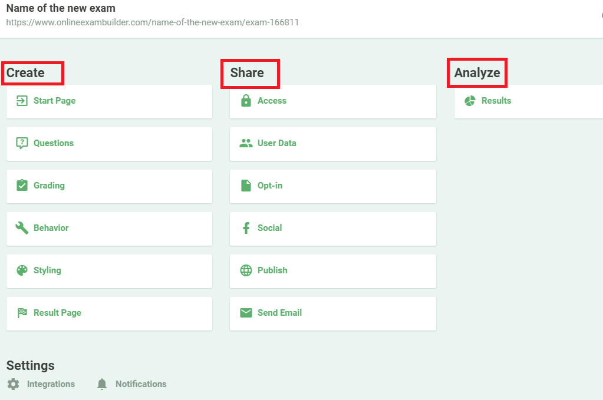

# Hi, I'm Lewis Mati

## About Me
I'm a student developer at Moringa School.

# Description

The project is about a simple test app that provides students instance questions and answers after taking test for any for easy revision .

*This is meant for students.

*The app is fast and has  variety of revisions materials .

*Its not age restricted

## How To Access Our Site

It's just simple how to access our site, all you need to have is just an internet connection, a browser and you are good to go. access our site and do your online questions and answers ,so excellent for self test practices .


## Appendix

The app runs on a single HTML ,CSS and JS file.

It is free,so no charges will apply when using the app.

it is also user friendly as it is not complicated to use,and is easy to access recipes according to one's requirements.

## Running Tests

To run tests, run the following command

```bash
  npm run test

```

## Deployment

To deploy this project run

```bash
  npm run deploy
```


## Used By

This project is used by the following:

- Moringa School.


## Contributing

Contributions are always welcome!

See `contributing.md` for ways to get started.

Please adhere to this project's `code of conduct`.

## Tech Stack

* HTML

* CSS

* JAVASCRIPT

# Screenshots




## Support

For support, lewis.mati@student.moringaschool.com


## Authors

- [LewisMati]([https://github.com/MatiMoringa/Independent-project-1)

## Feedback

If you have any feedback, please reach out to us lewis.mati@student.moringaschool.com


## Licence

[MIT](https://choosealicense.com/licenses/mit/)Copyright (c) 2022 Lewis Mati.


Permission is hereby granted, free of charge, to any person obtaining a copy of this software and associated documentation files , to deal in the Software without restriction, including without limitation the rights to use, copy, modify, merge, publish, distribute, sublicense, and/or sell copies of the Software, and to permit persons to whom the Software is furnished to do so, subject to the following conditions:

The above copyright notice and this permission notice shall be included in all copies or substantial portions of the Software.

THE SOFTWARE IS PROVIDED "AS IS", WITHOUT WARRANTY OF ANY KIND, EXPRESS OR IMPLIED, INCLUDING BUT NOT LIMITED TO THE WARRANTIES OF MERCHANTABILITY, FITNESS FOR A PARTICULAR PURPOSE AND NONINFRINGEMENT. IN NO EVENT SHALL THE AUTHORS OR COPYRIGHT HOLDERS BE LIABLE FOR ANY CLAIM, DAMAGES OR OTHER LIABILITY, WHETHER IN AN ACTION OF CONTRACT, TORT OR OTHERWISE, ARISING FROM, OUT OF OR IN CONNECTION WITH THE SOFTWARE OR THE USE OR OTHER DEALINGS IN THE SOFTWARE.


